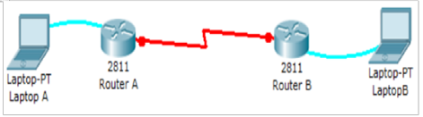

# 📡 PPP and HDLC Configurations Lab 🚀  

This lab explores **Point-to-Point Protocol (PPP)** and **High-Level Data Link Control (HDLC)** configurations for WAN connectivity between two routers. Follow the instructions to set up a PPP link with PAP authentication and observe how HDLC operates in a basic topology.

---

## 🛠️ Configuration Overview  
### ⚙️ Lab Topology  
- Two routers connected via a serial link.  
- Laptops used to access CLI interfaces.  
- Router A is the **DTE side**, and Router B is the **DCE side**.

---

### ✨ Key Steps  
1. **Determine DCE/DTE roles**:  
   Use the `show controllers serial <interface>` command.  
   Example:  
   ```
   Router-A#show controllers serial 0/0/0
   ```
   - Router A: DTE  
   - Router B: DCE  

2. **Configure Clock Rate**:  
   Set clock rate on Router B (DCE).  
   ```  
   Router-B(config)#interface serial 0/0/0  
   Router-B(config-if)#clock rate 250000  
   ```  

3. **PPP Configuration**:  
   Enable PPP encapsulation and IP configuration:  
   ```
   Router-B(config-if)#encapsulation ppp  
   Router-B(config-if)#ip address 192.168.10.5 255.255.255.252  
   Router-B(config-if)#no shutdown  
   ```  
   Similarly, configure Router A with:  
   ```
   Router-A(config-if)#encapsulation ppp  
   Router-A(config-if)#ip address 192.168.10.6 255.255.255.252  
   Router-A(config-if)#no shutdown  
   ```  

4. **Test Connectivity**:  
   Use the `ping` command to verify the connection:  
   ```
   Router-A#ping 192.168.10.5  
   ```

---

## 🌟 Future Scope  

- 🚀 **Dynamic Authentication Methods**: Explore and implement CHAP authentication in addition to PAP for enhanced security.  
- 🌐 **Real-World Use Cases**: Simulate real-world scenarios involving ISP configurations or MPLS VPNs.  
- 💻 **WAN Protocols Comparison**: Study the efficiency of PPP and HDLC under different network conditions.  
- 🛡️ **Security Enhancements**: Investigate how encryption mechanisms can be integrated with PPP links.  

Contributions are **welcome**! Let's make this lab a growing resource for networking enthusiasts. ✨  

---

## 🤝 Open Contributions  

We encourage you to contribute and enhance this lab! Here's how you can help:  
1. Add more examples with **detailed steps**.  
2. Include **advanced troubleshooting commands** for PPP and HDLC.  
3. Submit **PRs with formatted diagrams** and well-commented code snippets.  
4. Share **your experiences** working on similar configurations.  

Simply fork this repository and send a PR! 😊  

---

## 🎉 Let's Make Learning Networking Fun!  

With the right tools and enthusiasm, diving into networking configurations becomes a lot more engaging. Happy learning! 📚✨  

---

