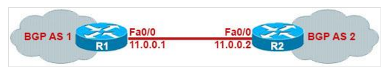

# Lab 11: BGP Implementation

This document outlines the implementation of Border Gateway Protocol (BGP) between two autonomous systems (AS) using the network diagram provided below.



---

## **Objective**
To configure BGP between two routers (R1 and R2) residing in separate autonomous systems, establish BGP neighbor relationships, and verify the communication.

---

## **Network Diagram**
- **R1** resides in **BGP AS 1**
- **R2** resides in **BGP AS 2**
- Interfaces:
  - **R1 Fa0/0**: 11.0.0.1
  - **R2 Fa0/0**: 11.0.0.2
- Loopback Interfaces:
  - **R1 Loopback 0**: 1.1.1.1
  - **R2 Loopback 0**: 2.2.2.2

---

## **Configuration Steps**

### 1. Configure Interfaces on R1 and R2

#### **R1 Configuration:**
```plaintext
R1(config)#interface fastethernet0/0
R1(config-if)#ip address 11.0.0.1 255.255.255.0
R1(config-if)#no shutdown

R1(config)#interface loopback 0
R1(config-if)#ip address 1.1.1.1 255.255.255.0
```

#### **R2 Configuration:**
```plaintext
R2(config)#interface fastethernet0/0
R2(config-if)#ip address 11.0.0.2 255.255.255.0
R2(config-if)#no shutdown

R2(config)#interface loopback 0
R2(config-if)#ip address 2.2.2.2 255.255.255.0
```

---

### 2. Configure BGP

#### **R1 BGP Configuration:**
```plaintext
R1(config)#router bgp 1
R1(config-router)#neighbor 11.0.0.2 remote-as 2
```

#### **R2 BGP Configuration:**
```plaintext
R2(config)#router bgp 2
R2(config-router)#neighbor 11.0.0.1 remote-as 1
```

---

### 3. Verify BGP Neighbor Relationship
After configuration, the routers should form a BGP neighbor relationship. Verification messages on R1 and R2:

- **On R1:**
```plaintext
*Aug 17 00:09:38.453: %BGP-5-ADJCHANGE: neighbor 11.0.0.2 Up
```

- **On R2:**
```plaintext
*Aug 17 00:09:38.453: %BGP-5-ADJCHANGE: neighbor 11.0.0.1 Up
```

You can use the following command to verify the BGP summary on both routers:

#### **Command:**
```plaintext
show ip bgp summary
```

#### **Output on R1:**
```plaintext
BGP router identifier 1.1.1.1, local AS number 1
BGP table version is 1, main routing table version 1
Neighbor    V    AS   MsgRcvd   MsgSent   TblVer  InQ  OutQ  Up/Down  State/PfxRcd
11.0.0.2    4    2    19        19        1       0    0     00:16:21
```

#### **Output on R2:**
```plaintext
BGP router identifier 2.2.2.2, local AS number 2
BGP table version is 1, main routing table version 1
Neighbor    V    AS   MsgRcvd   MsgSent   TblVer  InQ  OutQ  Up/Down  State/PfxRcd
11.0.0.1    4    1    20        20        1       0    0     00:17:13
```

---

### 4. Advertise Networks in BGP
#### **R1 Network Advertisement:**
```plaintext
R1(config-router)#network 1.1.1.0 mask 255.255.255.0
```

This adds the loopback interface (1.1.1.0/24) to R1's BGP routing table.

#### **BGP Routing Table on R1:**
```plaintext
R1#show ip bgp
BGP table version is 4, local router ID is 1.1.1.1
Status codes: s suppressed, d damped, h history, * valid, > best, i - internal
Origin codes: i - IGP, e - EGP, ? - incomplete

   Network    Next Hop    Metric LocPrf Weight Path
*> 1.1.1.0    0.0.0.0     0      100    0      i
```

---

## **Verification**
Use the following commands to verify the configuration:

1. **Check Neighbor Relationships:**
```plaintext
show ip bgp summary
```

2. **Check BGP Routing Table:**
```plaintext
show ip bgp
```

3. **Ping the Neighbor:**
```plaintext
ping 11.0.0.2
```

---

## **Conclusion**
By following the above steps, we successfully implemented and verified BGP between two autonomous systems. The network diagram and commands provided serve as a comprehensive guide for setting up and testing the configuration.
