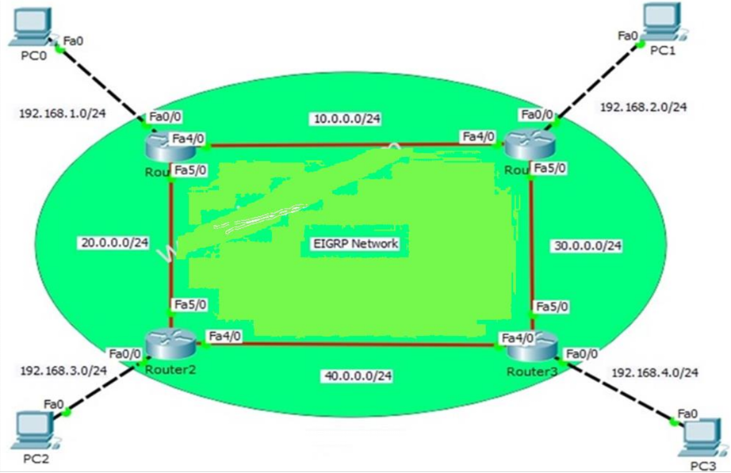

# Lab 12: EIGRP Implementation

## Overview
This lab focuses on implementing Enhanced Interior Gateway Routing Protocol (EIGRP) in a simulated network environment using Cisco Packet Tracer. The network is designed to demonstrate the use of EIGRP for efficient and scalable routing. The setup includes four routers connected to multiple PCs across different subnets, ensuring seamless communication between all devices.

---

## Network Topology
The network consists of the following components:

- **Four routers**: Router0, Router1, Router2, and Router3.
- **Four PCs**: PC0, PC1, PC2, and PC3.
- **Subnet allocation**:
  - PC0 (192.168.1.0/24)
  - PC1 (192.168.2.0/24)
  - PC2 (192.168.3.0/24)
  - PC3 (192.168.4.0/24)
- **Inter-router subnets**:
  - 10.0.0.0/24 (Router0 ↔ Router1)
  - 20.0.0.0/24 (Router0 ↔ Router2)
  - 30.0.0.0/24 (Router1 ↔ Router3)
  - 40.0.0.0/24 (Router2 ↔ Router3)

### Network Diagram
The network architecture is illustrated below:



---

## Objectives
- Configure EIGRP on all routers.
- Verify connectivity between all PCs.
- Ensure the routing table on each router contains all necessary routes.
- Optimize the EIGRP configuration for scalability and efficiency.

---

## Configuration Steps

### 1. Basic Router Configuration
1. Assign IP addresses to router interfaces based on the topology.
2. Configure interfaces with the correct subnet masks.
3. Enable interfaces.

Example:
```bash
Router> enable
Router# configure terminal
Router(config)# interface FastEthernet0/0
Router(config-if)# ip address 192.168.1.1 255.255.255.0
Router(config-if)# no shutdown
```

### 2. EIGRP Configuration
1. Enable EIGRP on each router:
   ```bash
   Router(config)# router eigrp 1
   Router(config-router)# network 192.168.1.0 0.0.0.255
   Router(config-router)# network 10.0.0.0 0.0.0.255
   ```
2. Configure the Autonomous System (AS) number as `1`.
3. Use the `no auto-summary` command to disable automatic summarization.

### 3. Verification
1. Verify EIGRP neighbors:
   ```bash
   Router# show ip eigrp neighbors
   ```
2. Verify the routing table:
   ```bash
   Router# show ip route
   ```
3. Test connectivity using `ping`:
   ```bash
   Router# ping 192.168.4.1
   ```

---

## Testing and Troubleshooting
1. **Connectivity**:
   - Use `ping` and `traceroute` to test communication between PCs.
2. **EIGRP Verification**:
   - Ensure all routers establish neighbor relationships.
   - Check routing tables for all subnets.
3. **Network Performance**:
   - Simulate link failures and ensure EIGRP converges to an alternate route.

---

## Conclusion
This lab demonstrates the configuration and functionality of EIGRP in a multi-router environment. The protocol's scalability and fast convergence make it a preferred choice for enterprise networks.

---

## How to Use the Lab
1. Open the `eigrp.pkt` file in Cisco Packet Tracer.
2. Examine the network topology and device configurations.
3. Follow the configuration steps outlined above to implement EIGRP.
4. Use the testing commands to verify network performance and troubleshoot any issues.

