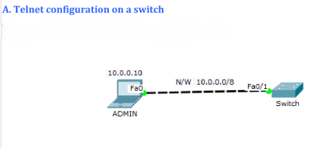
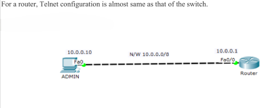

# 📡 Telnet Configuration & Network Security

## 📌 Introduction
This project focuses on configuring **Telnet** on Cisco routers and switches, ensuring secure remote access to network devices. The guide includes setup procedures, security enhancements, and troubleshooting methods for managing Telnet effectively.

---

## 🔧 Prerequisites
Before configuring Telnet, ensure the following requirements are met:

- **Cisco Packet Tracer or a physical lab setup**
- **Basic networking knowledge**
- **A router and a switch with at least two PCs**
- **Console access to network devices**

---

##  Network Topology
Below is the network topology used in this project:



---

## 🛠 Configuration Steps

### 🔹 Step 1: Setting up IP addresses
```sh
Router> enable
Router# configure terminal
Router(config)# interface FastEthernet 0/0
Router(config-if)# ip address 192.168.1.1 255.255.255.0
Router(config-if)# no shutdown
Router(config-if)# exit
```

### 🔹 Step 2: Enabling Telnet on the Router
```sh
Router(config)# line vty 0 4
Router(config-line)# password cisco
Router(config-line)# login
Router(config-line)# transport input telnet
Router(config-line)# exit
```

### 🔹 Step 3: Setting up a Username & Password
```sh
Router(config)# username admin privilege 15 secret password123
Router(config)# line vty 0 4
Router(config-line)# login local
Router(config-line)# exit
```

### 🔹 Step 4: Enabling Encryption (for Security)
```sh
Router(config)# service password-encryption
```

### 🔹 Step 5: Saving the Configuration
```sh
Router# write memory
```

---

## 🖥 Connecting via Telnet
On a remote system, use the following command:
```sh
telnet 192.168.1.1
```
Enter the **username** and **password** configured earlier to gain access.

---

## 🔐 Security Enhancements
To improve security, consider implementing the following:
- Restricting Telnet access to specific IP addresses:
  ```sh
  Router(config)# access-list 1 permit 192.168.1.100
  Router(config)# line vty 0 4
  Router(config-line)# access-class 1 in
  Router(config-line)# exit
  ```
- Disabling Telnet in favor of **SSH**:
  ```sh
  Router(config)# line vty 0 4
  Router(config-line)# transport input ssh
  Router(config-line)# exit
  ```

---

## 🚀 Troubleshooting
### 🔹 Common Issues & Fixes
| Issue | Solution |
|--------|----------|
| Unable to Telnet | Check if Telnet service is enabled and the IP is correctly configured |
| Authentication failure | Verify username and password settings |
| Connection refused | Ensure the VTY lines are not disabled |

---

## 📌 Conclusion
By following these steps, you can successfully configure and secure Telnet access on a Cisco device. However, for enhanced security, **SSH is always recommended over Telnet** due to encryption support.

---

Made with ❤️ by Nishant Sheoran
