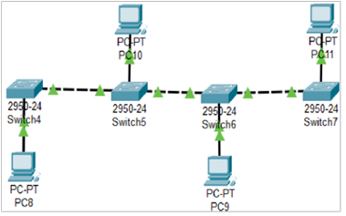
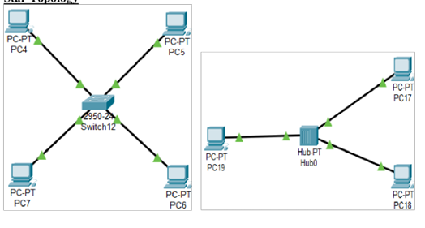
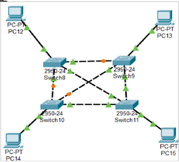
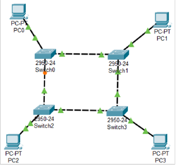
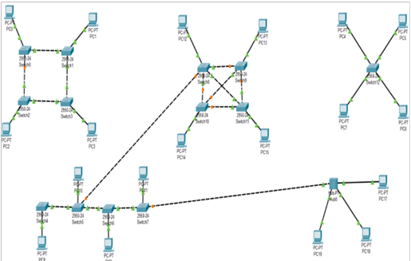

# Lab 2: Peer-to-Peer Networking and Topologies 🖧

## Overview
This lab focuses on understanding peer-to-peer (P2P) networking and different network topologies. It is divided into two parts:
- **Part A:** Demonstration of a P2P network using copper crossover cables.
- **Part B:** Design and implementation of a Local Area Network (LAN) using straight-through cabling in five different topologies.

---

## Part A: Peer-to-Peer Networking using Copper Crossover Cables

In this section, we established direct communication between two devices using copper crossover cables. The following key steps were performed:

1. Configured IP addresses manually for both devices.
2. Connected them using a crossover cable.
3. Verified connectivity using the `ping` command.
4. Transferred small files between devices to validate the P2P setup.

This setup helped in understanding the fundamental working of P2P networking, where devices communicate directly without a central server.

---

## Part B: Local Area Network (LAN) Topologies using Straight-Through Cabling

We implemented a LAN using straight-through cables and explored five different network topologies. Each topology was designed and tested to observe its characteristics, advantages, and drawbacks.

### 1. Bus Topology
A single central cable (backbone) is used to connect all devices. Data travels in both directions along the backbone, making it simple but susceptible to network failures if the backbone is damaged.

### 2. Star Topology
All devices are connected to a central switch, ensuring efficient communication and easy troubleshooting.

### 3. Mesh Topology
Each device is connected to every other device, ensuring high redundancy and fault tolerance.

### 4. Ring Topology
Devices are connected in a circular manner, with data traveling in a unidirectional or bidirectional loop.

### 5. Hybrid Topology
A combination of multiple topologies to achieve scalability and fault tolerance.

---

## Summary
- **P2P networking using crossover cables** allows direct device-to-device communication without a central entity.
- **LAN using straight-through cables** was implemented in different network topologies, each with unique advantages and limitations.

This lab provided hands-on experience in setting up basic networking configurations and understanding topological designs.

**Made with ❤️ by Nishant Sheoran**

