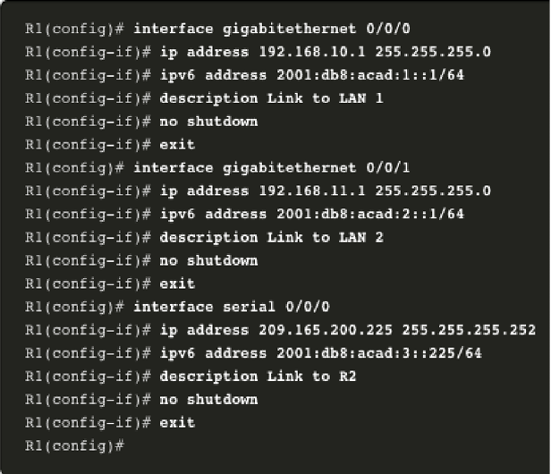

# Lab 3: Router Configuration 🖧

## Overview
This lab demonstrates the basic configuration of a router, including interface setup, IP addressing (IPv4 & IPv6), and authentication using console access. By the end of this lab, you will understand how to configure router interfaces and secure access with authentication.

## Part A: Router Interface Configuration
In this section, we configure the router interfaces with IP addresses, descriptions, and enable them.

### **Configuration Steps:**
1. **Access the Router CLI**
2. **Configure Interfaces**
3. **Assign IPv4 and IPv6 Addresses**
4. **Enable the Interfaces**
5. **Verify Configuration**

### **Example Configuration:**
```bash
R1(config)# interface gigabitethernet 0/0/0
R1(config-if)# ip address 192.168.10.1 255.255.255.0
R1(config-if)# ipv6 address 2001:db8:acad:1::1/64
R1(config-if)# description Link to LAN 1
R1(config-if)# no shutdown
R1(config-if)# exit

R1(config)# interface gigabitethernet 0/0/1
R1(config-if)# ip address 192.168.11.1 255.255.255.0
R1(config-if)# ipv6 address 2001:db8:acad:2::1/64
R1(config-if)# description Link to LAN 2
R1(config-if)# no shutdown
R1(config-if)# exit

R1(config)# interface serial 0/0/0
R1(config-if)# ip address 209.165.200.225 255.255.255.252
R1(config-if)# ipv6 address 2001:db8:acad:3::225/64
R1(config-if)# description Link to R2
R1(config-if)# no shutdown
R1(config-if)# exit
```

## Part B: Securing Router Access with Console Authentication
To prevent unauthorized access, we configure authentication for console access.

### **Configuration Steps:**
1. **Set a Password for Console Access**
2. **Enable Login Authentication**

### **Example Configuration:**
```bash
R1(config)# line console 0
R1(config-line)# password cisco
R1(config-line)# login
R1(config-line)# exit
```

## Verification Commands
After configuration, use the following commands to verify settings:

- **Show IP Interfaces:**
  ```bash
  R1# show ip interface brief
  ```
- **Show Running Configuration:**
  ```bash
  R1# show running-config
  ```

---

## Summary
- Configured router interfaces with IPv4 and IPv6 addresses.
- Enabled interfaces and added descriptions.
- Secured router access using console authentication.

📷 **Console Image:**


**Made with ❤️ by Nishant Sheoran**

