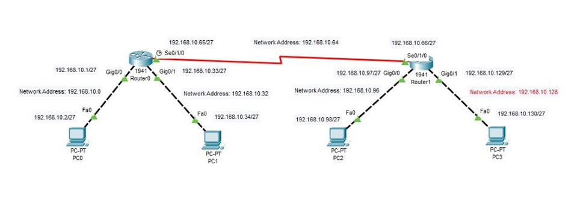

# Lab 5 - Static and Default Routing 🚀

## Introduction 📌
Routing is a crucial process in networking that enables data packets to reach their intended destinations. There are multiple ways to achieve routing, with **Static Routing** and **Default Routing** being two fundamental methods.

### Static Routing 🛠️
Static routing is a manual method where network administrators configure routes explicitly. It is best suited for small networks where changes are infrequent. This method ensures control and security but lacks scalability.

### Default Routing 🌍
Default routing is used when a router is configured to send all packets destined for unknown networks to a single next-hop address. It is particularly useful in stub networks, where a router has only one path to the rest of the network.

---

## Components 🖥️
### Devices and Connections:
- **PCs:** 4 🖥️
- **Routers:** 2 📡
- **Switches:** 1 🔄
- **Cables:** 4 Copper Cross-over ⚡
- **Serial DCE Cable:** 1 🔌

### Addressing Table 📋
| Device  | Interface   | IP Address      | Subnet Mask      | Gateway        |
|---------|------------|----------------|-----------------|---------------|
| PCO     | Fa0/0      | 192.168.10.2    | 255.255.255.224 | 192.168.10.1  |
| PC1     | Fa0/0      | 192.168.10.34   | 255.255.255.224 | 192.168.10.33 |
| PC2     | Fa0/0      | 192.168.10.98   | 255.255.255.224 | 192.168.10.97 |
| Router0 | G0/0       | 192.168.10.1    | 255.255.255.224 | -             |
| Router0 | G0/1       | 192.168.10.33   | 255.255.255.224 | -             |
| Router0 | Se0/1/0    | 192.168.10.65   | 255.255.255.224 | -             |
| Router1 | G0/0       | 192.168.10.97   | 255.255.255.224 | -             |
| Router1 | G0/1       | 192.168.10.129  | 255.255.255.224 | -             |
| Router1 | Se0/1/0    | 192.168.10.66   | 255.255.255.224 | -             |



---

## Static Routing Implementation 
To verify the static routing configuration, use the following command:
```bash
Router> enable
Router# show ip route
```
Expected output:
```
Codes: L - local, C - connected, S - static, R - RIP, M - mobile, B - BGP,
       D - EIGRP, EX - EIGRP external, O - OSPF, IA - OSPF inter area,
       N1 - OSPF NSSA external type 1, N2 - OSPF NSSA external type 2,
       E1 - OSPF external type 1, E2 - OSPF external type 2, E - EGP,
       i - IS-IS, L1 - IS-IS level-1, L2 - IS-IS level-2, ia - IS-IS inter area,
       * - candidate default, U - per-user static route, o - ODR,
       P - periodic downloaded static route

Gateway of last resort is not set

192.168.10.0/24 is variably subnetted, 8 subnets, 2 masks
C   192.168.10.0/27 is directly connected, GigabitEthernet0/0
L   192.168.10.1/32 is directly connected, GigabitEthernet0/0
C   192.168.10.32/27 is directly connected, GigabitEthernet0/1
L   192.168.10.33/32 is directly connected, GigabitEthernet0/1
C   192.168.10.64/27 is directly connected, Serial0/1/0
L   192.168.10.65/32 is directly connected, Serial0/1/0
S   192.168.10.96/27 [1/0] via 192.168.10.66
S   192.168.10.128/27 [1/0] via 192.168.10.66
```

---

## Default Routing Implementation 🔀
To implement default routing, configure the following command on **Router0**:
```bash
Router0(config)# ip route 0.0.0.0 0.0.0.0 192.168.10.66
```
And on **Router1**:
```bash
Router1(config)# ip route 0.0.0.0 0.0.0.0 192.168.10.65
```
Now, verify the default route with:
```bash
Router# show ip route
```
Expected output:
```
S*   0.0.0.0/0 [1/0] via 192.168.10.66
```
This ensures that any unknown destination will be forwarded to the next-hop router.

---

## Verification of Routing Configurations ✅

### Verifying Static Routing 🏗️
Once static routes have been configured, you can verify their correctness using the following command:
```bash
Router# show ip route
```
Expected output:
```
S   192.168.10.96/27 [1/0] via 192.168.10.66
S   192.168.10.128/27 [1/0] via 192.168.10.66
```
Additionally, you can test connectivity using:
```bash
Router# ping <destination IP>
```
If the ping is successful, the routing is properly configured.

### Verifying Default Routing 🔀
To confirm that the default route is active, run:
```bash
Router# show ip route
```
Expected output:
```
S*   0.0.0.0/0 [1/0] via 192.168.10.66
```
To test if the default route works, try:
```bash
Router# traceroute <external IP>
```
This will show the path packets take when forwarded beyond known networks.

---

### Files Included 📂
- **Static_Routing.pkt** - Packet Tracer file for static routing setup.
- **Default_Routing.pkt** - Packet Tracer file for default routing setup.
- **routing_nd.png** - Network topology image.

---

**Made with ❤️ by Nishant Sheoran**

