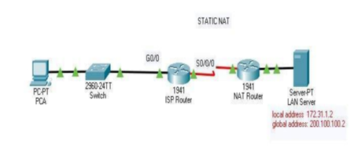
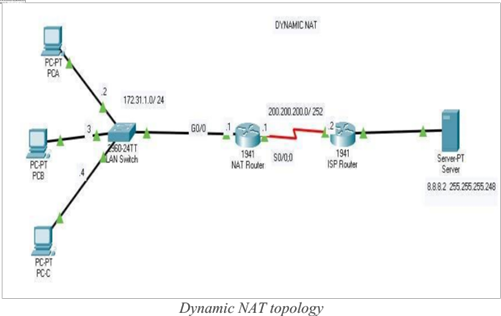

# LAB 6: NAT Configuration 🖧

Welcome to the **NAT Configuration Lab**! This lab explores how to configure Static and Dynamic NAT on Cisco routers. Networking can be fun and engaging—let's dive in! 🚀

## 📌 Static NAT Configuration

Steps to configure Static NAT:
1. **Create a Mapping**: Map the private internal address to the public global address using:
   ```
   ip nat inside source static [private-address] [public-address]
   ```
2. **Assign Interfaces**: Configure the router interfaces as `inside` or `outside` with respect to NAT:
   - Assign the `inside` interface:
     ```
     ip nat inside
     ```
   - Assign the `outside` interface:
     ```
     ip nat outside
     ```

### Example 💡
To map the private address `172.31.1.2` to the public address `200.100.100.2`:
```plaintext
Router>enable
Router#configure terminal
Router(config)#ip nat inside source static 172.31.1.2 200.100.100.2
Router(config)#interface serial 0/0/0
Router(config-if)#ip nat outside
Router(config-if)#interface gigabitethernet 0/0
Router(config-if)#ip nat inside
Router(config-if)#
```

## 🌐 Dynamic NAT Configuration

Steps to configure Dynamic NAT:
1. **Create an ACL**: Define the private addresses to be translated:
   ```
   access-list 1 permit [private-network] [wildcard-mask]
   ```
2. **Define a NAT Pool**: Create a pool of public addresses:
   ```
   ip nat pool [name] [first-address] [last-address] netmask [subnet-mask]
   ```
3. **Bind ACL to NAT Pool**: Link the ACL and NAT pool:
   ```
   ip nat inside source list [access-list-number] pool [name]
   ```

### Example 💡
To allow internal hosts in the `172.31.1.0` network to access the internet using two public addresses `200.100.100.1` and `200.100.100.2`:
```plaintext
Router>enable
Router#configure terminal
Router(config)#access-list 1 permit 172.31.1.0 0.0.0.255
Router(config)#ip nat pool LAN 200.100.100.1 200.100.100.2 netmask 255.255.255.0
Router(config)#ip nat inside source list 1 pool LAN
Router(config)#interface serial 0/0/0
Router(config-if)#ip nat outside
Router(config-if)#interface gigabitethernet 0/0
Router(config-if)#ip nat inside
Router(config-if)#
```

### Results ✅
Congratulations! You have successfully configured Static and Dynamic NAT on a Cisco router. 🎉

## ➕ Additional Notes
- Remember to save your configuration with:
  ```
  write memory
  ```
- Always verify NAT translations using:
  ```
  show ip nat translations
  ```

## 🤝 Contributions
Networking is better when shared! 🌍 If you find this README helpful or have ideas to improve it, feel free to contribute. Check out our [CONTRIBUTING.md](#) to get started. 💡


Made with ❤️ by Nishant Sheoran
