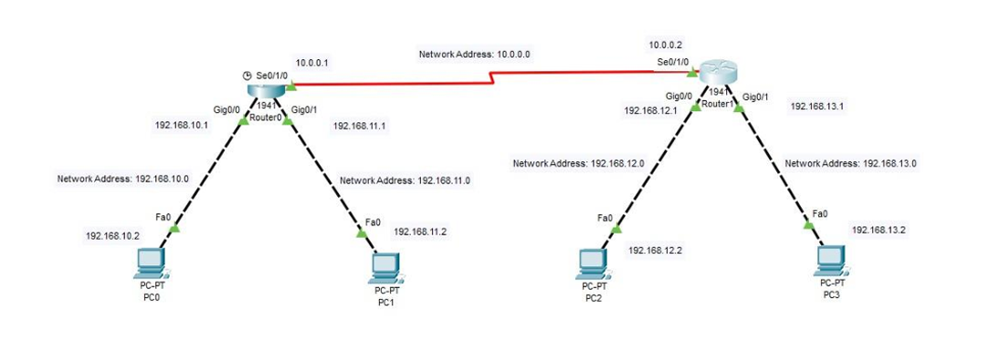

# Lab 7: RIP Implementation (v1 and v2) 🖧

## Overview
This lab focuses on implementing Routing Information Protocol (RIP) versions 1 and 2. The objective is to understand the differences between the two versions and correctly configure them in a Cisco packet tracer simulation.

### RIP v1 vs. RIP v2 🔍
Routing Information Protocol (RIP) is a distance-vector routing protocol that helps routers dynamically learn routes. It operates using hop count as the metric.

- **RIP v1:**
  - Classful protocol (does not send subnet mask information).
  - Uses broadcast updates (255.255.255.255).
  - No support for VLSM (Variable Length Subnet Masking) or CIDR (Classless Inter-Domain Routing).
  
- **RIP v2:**
  - Classless protocol (includes subnet mask information).
  - Uses multicast updates (224.0.0.9) for efficient routing.
  - Supports VLSM and CIDR, improving network scalability.
  
## Network Diagram
Refer to the provided network topology to design and implement RIP routing.


---

## RIP v1 Addressing Table
| Device  | Known Networks  | Subnet Mask  |
|---------|---------------|--------------|
| Router0 | 192.168.10.0  | 255.255.255.0 |
| Router0 | 192.168.11.0  | 255.255.255.0 |
| Router0 | 10.0.0.0      | 255.0.0.0     |
| Router1 | 192.168.12.0  | 255.255.255.0 |
| Router1 | 192.168.13.0  | 255.255.255.0 |
| Router1 | 10.0.0.0      | 255.0.0.0     |

### Configuring RIP v1
1. Access the router CLI.
2. Enter the following commands:
```bash
Router#configure terminal
Router(config)#router rip
Router(config-router)#network 192.168.10.0
Router(config-router)#network 192.168.11.0
Router(config-router)#network 10.0.0.0
Router(config-router)#exit
Router#
```
---

## RIP v2 Addressing Table
| Device  | Known Networks  | Subnet Mask  | Unknown Networks | Subnet Mask  | Next-hop Address |
|---------|---------------|--------------|-----------------|--------------|------------------|
| Router0 | 192.168.10.0  | 255.255.255.224 | 192.168.10.96  | 255.255.255.224 | 192.168.10.65 |
| Router0 | 192.168.10.32  | 255.255.255.224 | 192.168.10.128 | 255.255.255.224 | 192.168.10.65 |
| Router0 | 192.168.10.64  | 255.255.255.224 | -              | -              | -              |
| Router1 | 192.168.10.96  | 255.255.255.224 | 192.168.10.160 | 255.255.255.224 | 192.168.10.65 |
| Router1 | 192.168.10.128 | 255.255.255.224 | 192.168.10.32  | 255.255.255.224 | 192.168.10.65 |
| Router1 | 192.168.10.64  | 255.255.255.224 | -              | -              | -              |

### Configuring RIP v2
1. Access the router CLI.
2. Enter the following commands:
```bash
Router#configure terminal
Router(config)#router rip
Router(config-router)#version 2
Router(config-router)#network 192.168.10.0
Router(config-router)#network 192.168.10.32
Router(config-router)#network 192.168.10.64
Router(config-router)#no auto-summary
Router(config-router)#exit
Router#
```

---

## Summary
- **RIP v1** is a classful routing protocol that does not support subnet information.
- **RIP v2** is a classless routing protocol that includes subnet masks and supports CIDR.

This lab helps in understanding the differences between RIP versions and their implementation.

**Made with ❤️ by Nishant Sheoran**

