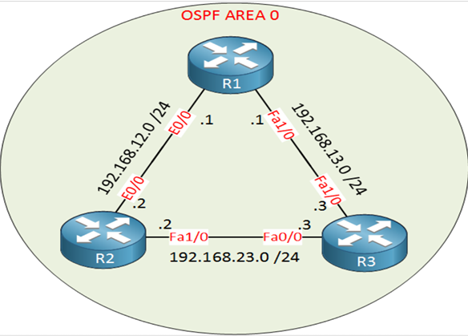

# Lab 8: Single Area OSPF Experiment 

## 📝 Objective
To configure and verify a single-area OSPF setup using Cisco Packet Tracer, focusing on understanding OSPF principles, wildcard masks, and router neighbor relationships.

---

## 🛠️ Prerequisites

Before starting this lab, ensure the following:

- Familiarity with basic router configurations.
- Cisco Packet Tracer installed on your system.
- Basic knowledge of IP addressing and subnetting.

---

## 🔗 Network Topology

Refer to the following topology for this lab:



---

## ⚙️ Configuration Steps

### Step 1: Router Configurations
1. **Access the CLI of each router.**
2. Configure the interfaces with the provided IP addresses from the topology diagram.
3. Enable OSPF process with a process ID (e.g., `router ospf 1`).

### Step 2: Define Networks in OSPF
Use the `network` command with appropriate wildcard masks to include interfaces in Area 0. For example:

```plaintext
R1(config-router)# network 192.168.12.0 0.0.0.255 area 0
R1(config-router)# network 192.168.13.0 0.0.0.255 area 0
```

Repeat for all routers as per the topology.

### Step 3: Verify OSPF Neighbors
After configurations, verify OSPF neighbor relationships:

```plaintext
R1# show ip ospf neighbor
```

The output should show the neighboring routers in FULL state.

### Step 4: Inspect OSPF Routing Table
Verify the OSPF routes:

```plaintext
R1# show ip route ospf
```

---

## 🛡️ Key Points to Remember

- Wildcard masks are the inverse of subnet masks. For example, a subnet mask of `255.255.255.0` corresponds to a wildcard mask of `0.0.0.255`.
- All routers in a single area OSPF must be configured to belong to the same area.
- Use `show ip ospf neighbor` to ensure neighbor adjacencies are established.

---

## 📊 Verification

1. Check OSPF neighbors:
   ```plaintext
   R1# show ip ospf neighbor
   ```
2. View OSPF process information:
   ```plaintext
   R1# show ip protocols
   ```
3. Inspect OSPF routing table:
   ```plaintext
   R1# show ip route ospf
   ```

---

## 🌟 Learning Outcomes

By completing this lab, you will:

- Understand OSPF single-area configurations.
- Learn to use wildcard masks for OSPF networks.
- Gain hands-on experience verifying OSPF neighbor relationships and routing tables.

---

**Made with ❤️ by Nishant Sheoran**
