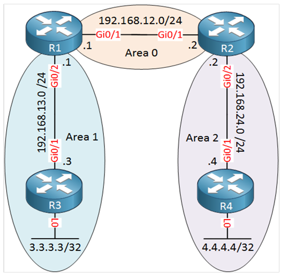

# Lab 9: Multi-Area OSPF 🌐

## Overview

This lab demonstrates how to configure and verify **Multi-Area OSPF (Open Shortest Path First)** in a network designed using Cisco Packet Tracer. The lab focuses on hierarchical OSPF design with three areas: Area 0 (Backbone), Area 1, and Area 2.

The goal is to understand OSPF area segmentation, inter-area communication, and verification of neighbor adjacencies and routing tables.

---

## 🟢 Network Topology



### IP Addressing Plan:

| Device | Interface       | IP Address      | Area  |
|--------|-----------------|-----------------|-------|
| R1     | Gi0/1           | 192.168.12.1   | Area 0|
| R2     | Gi0/1           | 192.168.12.2   | Area 0|
| R1     | Gi0/2           | 192.168.13.1   | Area 1|
| R3     | Gi0/1           | 192.168.13.3   | Area 1|
| R3     | Lo0             | 3.3.3.3        | Area 1|
| R2     | Gi0/2           | 192.168.24.2   | Area 2|
| R4     | Gi0/1           | 192.168.24.4   | Area 2|
| R4     | Lo0             | 4.4.4.4        | Area 2|

---

## ⚙️ Configuration Steps

### 1⃣ Step 1: Configure Backbone Area (Area 0)

Configure OSPF on **R1** and **R2** for Area 0:

```bash
R1(config)# router ospf 1
R1(config-router)# network 192.168.12.0 0.0.0.255 area 0

R2(config)# router ospf 1
R2(config-router)# network 192.168.12.0 0.0.0.255 area 0
```

### 2⃣ Step 2: Configure Area 1

Enable OSPF on **R1** and **R3** for Area 1:

```bash
R1(config)# router ospf 1
R1(config-router)# network 192.168.13.0 0.0.0.255 area 1

R3(config)# router ospf 1
R3(config-router)# network 192.168.13.0 0.0.0.255 area 1
R3(config-router)# network 3.3.3.3 0.0.0.0 area 1
```

### 3⃣ Step 3: Configure Area 2

Enable OSPF on **R2** and **R4** for Area 2:

```bash
R2(config)# router ospf 1
R2(config-router)# network 192.168.24.0 0.0.0.255 area 2

R4(config)# router ospf 1
R4(config-router)# network 192.168.24.0 0.0.0.255 area 2
R4(config-router)# network 4.4.4.4 0.0.0.0 area 2
```

---

## 🔍 Verification

### Neighbor Adjacencies

Verify OSPF neighbors using the `show ip ospf neighbor` command:

```bash
R1# show ip ospf neighbor
R2# show ip ospf neighbor
```

### Routing Table

Verify the OSPF routes in the routing table using the `show ip route` command:

```bash
R1# show ip route
R2# show ip route
R3# show ip route
R4# show ip route
```

---

## 📂 Project Files

- **[m_ospf_nd.png](./m_ospf_nd.png):** Network topology diagram.
- **[ospf_multi_area.pkt](./ospf_multi_area.pkt):** Cisco Packet Tracer project file for Multi-Area OSPF.

---

## 🤓 Key Learning Objectives

- Understand OSPF hierarchical design and its benefits.
- Learn to configure OSPF with multiple areas.
- Verify OSPF configurations using essential commands.
- Observe inter-area routing behavior.

---

Made with ❤️ by Nishant Sheoran
