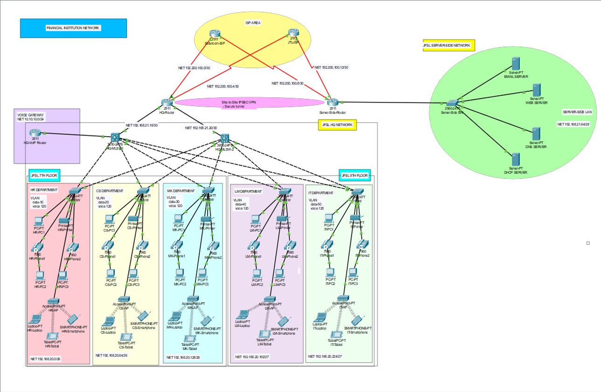

# Network Design and Implementation for State Bank of India (SBI) 🏦

## Overview
State Bank of India (SBI) is a leading financial institution in India. This project focuses on designing and implementing a secure, scalable, and high-performance network infrastructure for SBI’s headquarters and server-side site using Cisco Packet Tracer. The design adheres to the company's requirements for reliability, redundancy, scalability, and secure communication.

## Objectives
The project aims to:
- Develop a **hierarchical network design** for SBI headquarters and server-side sites.
- Ensure **redundancy** and **load balancing** by subscribing to two ISPs.
- Implement **secure communication** using Access Control Lists (ACLs), Virtual Private Networks (VPNs), and encrypted access protocols.
- Configure a network that ensures **confidentiality, integrity, and availability (CIA)** of data.
- Incorporate **VoIP services**, VLAN segmentation, DHCP, and inter-VLAN routing.

---

## Network Design Requirements

### Company Overview
- **Location**: India.
- **Floors Used**: 7th and 8th floors of an 11-story building.
- **Departments**:
  - **7th Floor**: Human Resources (HR), Customer Service (CS), Marketing (MK).
  - **8th Floor**: Legal Management (LM), Information Technology (IT).
- **Devices per Department**:
  - 7th Floor: 40 user devices, 40 IP phones, and 1 WiFi Access Point (AP) per department.
  - 8th Floor: 20 user devices, 20 IP phones, and 1 WiFi AP per department.



### Key Requirements
- **Separate VLANs** for each department.
- Secure and redundant **WAN connection** to an external server-side site.
- Redundant **ISP connections** with load balancing.
- Static IP addresses for server-side devices.
- Dynamic IP allocation for user devices using a **DHCP server**.
- Centralized **VoIP services** for IP phones.
- High-performance **inter-VLAN routing** using multilayer switches.
- Secure remote access using **SSH**.
- Site-to-site communication using **IPsec VPN**.

### IP Addressing Scheme
- **Data VLAN**: 192.168.20.0/24
- **Voice VLAN**: 10.10.10.0/24
- **Public IPs**: 190.200.100.0/24
- **Voice VLAN ID**: 120 (uniform across all departments).

---

## Technologies Implemented

### Networking Design
1. **Hierarchical Design**: Redundant core, distribution, and access layers.
2. **Redundancy**: Dual ISP connectivity with two independent ISPs.
3. **Device Integration**:
   - Core: Cisco Catalyst 2911 routers.
   - Distribution: Two multilayer switches.
   - Access: Six access switches for departments.

### Configurations
1. **Basic Device Settings**:
   - Hostnames, console passwords, encrypted passwords.
   - Banner messages and IP domain lookup disabled.
2. **VLAN Configuration**:
   - Separate VLANs for data and voice traffic.
   - Departments segregated into unique VLANs.
3. **Subnetting and IP Addressing**:
   - Dynamic IPs for devices using DHCP.
   - Static IPs for server-side devices.
4. **Routing Protocol**: OSPF for efficient and scalable route advertising.
5. **Security Features**:
   - SSH for remote access.
   - ACLs for VTY access and NAT.
   - Port security with sticky MAC and shutdown on violations.
6. **NAT Configuration**:
   - PAT using outbound router interfaces.
   - ACL to restrict PAT access.
7. **VoIP Services**:
   - Configured using Cisco 2811 VoIP router.
   - Dial numbers in the 4XX format.
8. **IPsec VPN**:
   - Site-to-site VPN between HQ and server-side routers.
   - ACLs for VPN traffic.
9. **Wireless Networks**: WiFi APs for all departments.

---

## Tools and Software Used
- **Cisco Packet Tracer**: To design, simulate, and test the network.
- **Networking Commands**: For testing and troubleshooting configurations.

---

## How to Use the Project
1. Open the project file `CNN PROJECT hq.pkt` in Cisco Packet Tracer.
2. Review the network topology, device configurations, and IP addressing.
3. Simulate communication using commands like `ping`, `traceroute`, and VoIP calls.
4. Modify configurations to explore different scenarios and test network resilience.

---

## Testing and Verification
1. Verify **inter-VLAN communication** using multilayer switches.
2. Test **dynamic IP allocation** using DHCP.
3. Check **secure remote access** using SSH.
4. Simulate **VoIP calls** and ensure connectivity.
5. Test **redundancy** by simulating ISP or device failures.
6. Validate **site-to-site communication** using IPsec VPN.
7. Confirm **network performance** meets company expectations.

---

## How to Contribute
1. **Fork the Repository**:
   - Navigate to [nishant-sheoran's GitHub repository](https://github.com/nishant-sheoran).
   - Click on the `Fork` button in the top-right corner.
2. **Clone the Repository**:
   ```bash
   git clone https://github.com/<your-username>/repository-name.git
   ```
3. **Make Changes**:
   - Create a new branch for your feature or bug fix.
   ```bash
   git checkout -b feature/your-feature-name
   ```
   - Commit your changes with clear and descriptive messages.
   ```bash
   git commit -m "Add your message here"
   ```
4. **Push Changes**:
   ```bash
   git push origin feature/your-feature-name
   ```
5. **Submit a Pull Request (PR)**:
   - Go to the original repository and click on `Pull Requests`.
   - Create a new pull request and provide details about your changes.
6. **Collaborate**:
   - Address any feedback provided by the repository maintainers.

---

## Author
With ❤️ [Nishant Sheoran](https://github.com/nishant-sheoran).

Feel free to connect or raise issues for further assistance or improvements!

